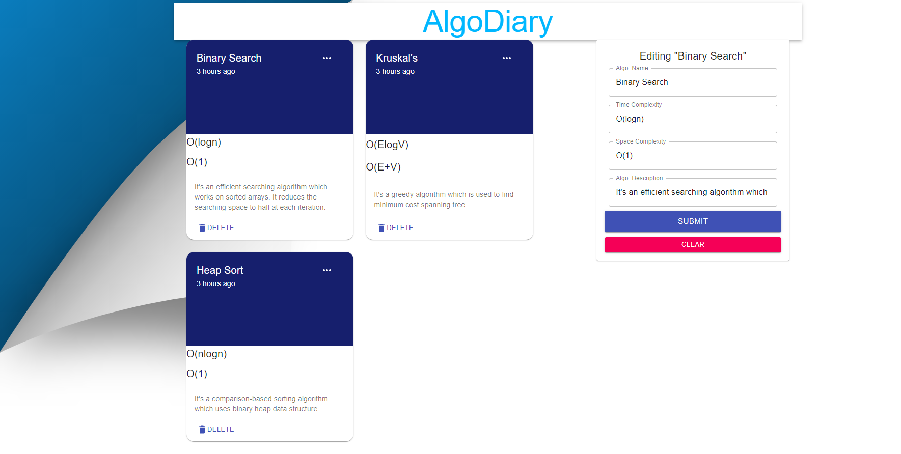

# AlgoDiary

A full stack application called 'AlgoDiaries' built using Node.js, React, MongoDB and Express. It helps to create your own digital flashcards to study algorithms.

Setup :
run npm start for both client and server side to start the app.
 
